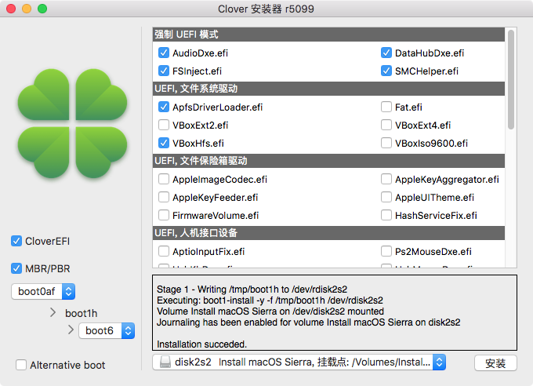

# Hackintosh-Install
# 黑苹果安装通用过程
[TOC]

**安装时<副本已损坏>错误如何处理**
> 这个“安装 macOS Sierra”应用程序副本已损坏，不能用来安装 macOS。
>
>问题原因：据说是2016年2月14日更新的证书后导致的问题，改到这个日期前就行了。
解决方案：启动后断开网络 -> 打开左上角实用工具 -> 找到终端打开输入 （切记一定要先断开网络再进行下面的操作）
```shell
sudo date 110713212015.30

11 月、07日、13时、21分、2015年、30秒 其实只要输入2016年2月14日这个日期之前的就行。
```
## 1.安装工具
- 1.1 [clover](https://github.com/CloverHackyColor/CloverBootloader/releases)
- 1.2 [Clover Configurator](https://mackie100projects.altervista.org/download-clover-configurator/)
- 1.3 [hackintool.zip](http://headsoft.com.au/download/mac/Hackintool.zip)

## 2. 驱动文件

1. SMC [VirtualSMC](https://github.com/acidanthera/VirtualSMC/releases) ~~暂时待定~~
2. SMC [fakeSMC](https://bitbucket.org/RehabMan/os-x-fakesmc-kozlek/downloads/) 历史可用
3. 基础patch包（路径E/L） [Lilu](https://github.com/acidanthera/Lilu/releases)
4. patch扩展 [LiluFriend](https://github.com/PMheart/LiluFriend/releases)
5. 显示辅助[WhateverGreen](https://github.com/acidanthera/WhateverGreen/releases)
6. USB驱动 [RehabMan-USBInjectAll-2018-1108.zip](https://bitbucket.org/RehabMan/os-x-usb-inject-all/downloads/)
7. 网卡驱动 [RTL8111](https://github.com/Mieze/RTL8111_driver_for_OS_X/releases)
8. 声卡驱动 [AppleALC](https://github.com/acidanthera/AppleALC/releases)
9. 变频驱动&电源管理注入[CPUFriend](https://github.com/acidanthera/CPUFriend/releases)
    - CPUFriendprovderdata.kext 生成 [ResourceConverter.sh](https://github.com/acidanthera/CPUFriend/blob/master/Tools/ResourceConverter.sh)

    - 粗略使用教程（https://blog.daliansky.net/CPUFriend-Installation-and-Usage.html）

    - 变频教程（https://change-y.github.io/2018/04/30/%E5%88%A9%E7%94%A8CPUFriend-kext%E5%AE%9E%E7%8E%B0%E5%8F%98%E9%A2%91/）

10. ps2键盘鼠标[VoodooPS2Controller](https://github.com/acidanthera/VoodooPS2/releases)
11. 同步多核心时钟频率 [VoodooTSCSync](https://github.com/RehabMan/VoodooTSCSync)
    - [https://bitbucket.org/RehabMan/VoodooTSCSync/downloads/](https://bitbucket.org/RehabMan/VoodooTSCSync/downloads/)
>此驱动必须安装 不安装会出现： still waiting for root device 错误
12. 睡眠修复[HibernationFixup](https://github.com/acidanthera/HibernationFixup/releases)
13. 欺骗pciid驱动 [FakePCIID](https://bitbucket.org/RehabMan/os-x-fake-pci-id/downloads/)

---

## 3. 制作U盘启动盘

>官方固件DMG下载地址 :[https://support.apple.com/zh-cn/HT201372](https://support.apple.com/zh-cn/HT201372)
>
>各版本固件下载地址收集：  
> 10.12.6 下载 ：https://apps.apple.com/cn/app/macos-sierra/id1127487414?mt=12  
> 10.13.6 下载 ：https://apps.apple.com/cn/app/macos-high-sierra/id1246284741&mt=12  
> 10.14.6 下载 ：https://apps.apple.com/cn/app/macos-mojave/id1398502828?mt=12  
> 10.15.x 下载 ：https://apps.apple.com/cn/app/macos-catalina/id1466841314?mt=12  
- 1. 下载固件
- 2. 制作启动盘  
macOS Sierra 10.12.X 的示例:
```
sudo /Applications/Install\ macOS\ Sierra.app/Contents/Resources/createinstallmedia --volume /Volumes/MyVolume --applicationpath /Applications/Install\ macOS\ Sierra.app
```
- 3. 安装clover引导 (clover.app v5099)
 
- 4. 配置config.plist文件
```java
 boot args: -v 0x2000
```

## 4. bios 设置 （x79）


* 关闭VT-d
* 开启 USB XHCI
* 关闭 USB EHCI
* 禁用 Serial Port


## 其他：
  * [常用工具](./常用工具.md)
