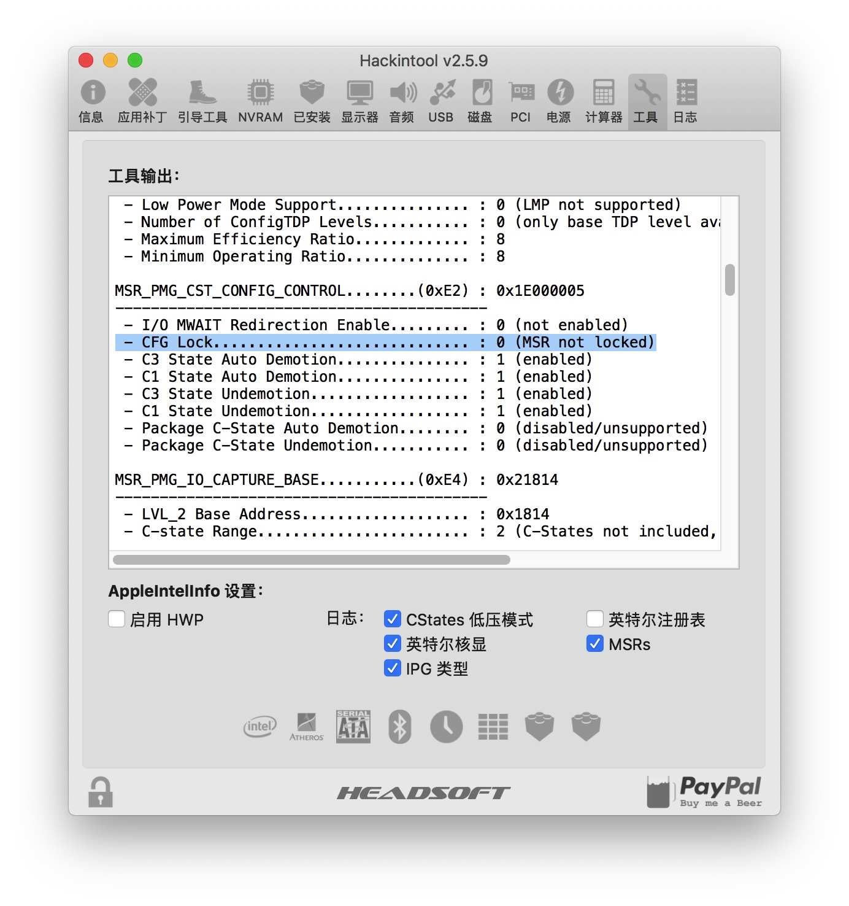
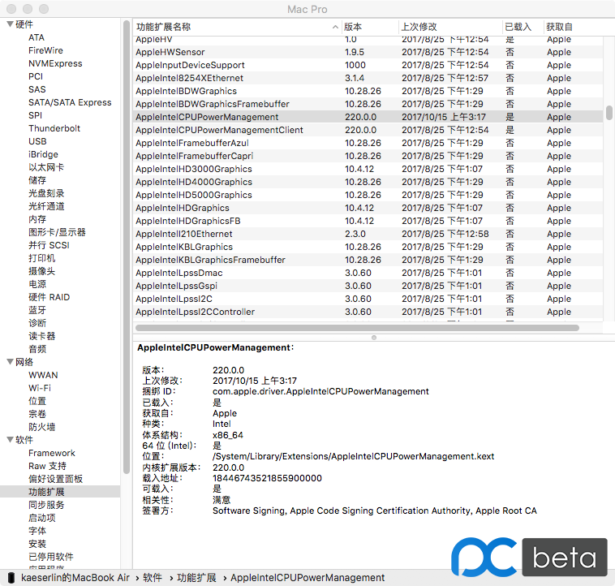
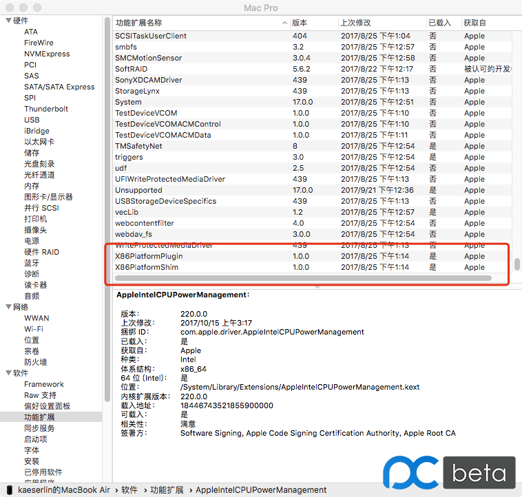

# X79主板安装macOS 10.12.6 安装说明


> 安装目标：macOS 10.12.6
>
> 主板型号：X79
>
> cpu: E5 2680 v1
>
> 网卡：RTL8168
>
> 声卡：Realtek ALC662
>
> 显卡：GTX650 1024M

## 0. bios 设置


* 关闭VT-d
* 开启 USB XHCI
* 关闭 USB EHCI
* 禁用 Serial Port
## 1. DSDT 提取和修复
- clover界面F4提取
- 编译成.aml
- 存放到EFI路径： OEM/X79/ACPI/patched
## 2. clover EFI目录驱动
>目录结构
>EFI/Clover/OEM/X79/kexts
>├── 10.11
>├── 10.12
│   ├── AppleALC.kext
│   ├── CPUFriend.kext
│   ├── FakeSMC.kext
│   ├── Lilu.kext
│   ├── LiluFriend.kext
│   ├── RealtekRTL8111.kext
│   ├── USBInjectAll.kext
│   ├── VoodooPS2Controller.kext
│   ├── VoodooTSCSync.kext
│   └── WhateverGreen.kext
├── 10.13
├── 10.14
├── 10.15
## 3. config.plist文件

[config.plist](./config.plist)

## 4. 网卡 RealtekRTL8111.kext 免驱
## 5. 显卡 GTX650 免驱
## 6. 声卡驱动 （我的x79注入id为5）
### 6.1 声卡修补
- 安装最新的 Lilu + AppleALC
- Clover Configurator 设置 config.plist ▸ Devices ▸ Audio ▸ Inject ▸ No
- 四叶草 (Clover) ▸ DSDT 重命名以下设备（如果需要）
  ☑️ AZAL ▸ HDEF
  ☑️ HDAS ▸ HDEF
- Hackintool 中 选中 补丁 ▸ 通用 ▸ 声音
- 设置 音频中 Layout ID下拉列表，选择或输入合适你的 Layout ID（X79以确定为5）
- 文件 ▸ 导出 ▸ Clover Config.plist（覆盖现有的config.plist文件）
- 重新启动
>如果没有音频依然存在问题，请返回步骤4并尝试不同的 Layout ID 注意：如果您尝试所有 Layout ID 但仍有问题，请尝试设置 补丁 ▸ 高级 ▸ 仿冒声卡 ID 选项。 如果这依然不起作用，那么尝试安装FakePCIID.kext + FakePCIID_Intel_HDMI_Audio.kext
>
> 如果有爆音，尝试在 Clover Configurator -> Boot 中设置为darkwake=no。


## 7. 电源管理 CPUFriend.kext 

> 生成CPUFriendDataProvider.kext [ResourceConverter.sh](https://github.com/acidanthera/CPUFriend/blob/master/Tools/ResourceConverter.sh)

### 7.1 经过不断地测试，初步可以总结出以下几点经验
>要想对变频效果进行调整及优化，
首先确保要加载了原生电源管理（从第四代CPU开始，都不加载CPU管理驱动了），体现在两个X86加载都是是(X86PlatformPlugin.kext, X86PlatformShim.kext)，有完整的电源管理面板。
* 加载X86有两种方法：
    * 采用ssdtPRGen.sh生成的ssdt。
    * 采用SSDT-XCPM.ssdt，clover设置plugin-Type=1（适用于Haswell后的CPU）
      >理论上应该如此，但在实际测试中需配合CPUFriend和CPUDateProvider才可以实现加载x86 以及完整的电源管理面板。

* 当以上情况满足后，就可以通过CPUDateProvider来提供变频所需要的数据，可以尝试不同机型的plist生成的CPUDateProvider，以达到最佳变频效果。

### 7.2 具体操作步骤：
- 1. 下载CPUFriernd.kext
- 2. 下载ResourceConverter.sh
- 3. 在ResourceConverter.sh所在目录运行以下命令

  ```java
  ./ResourceConverter.sh --kext /System/Library/Extensions/IOPlatformPluginFamily.kext/Contents/PlugIns/X86PlatformPlugin.kext/Contents/Resources/Mac-F60DEB81FF30ACF6.plist
  ```
  其中后边的文件按目录找到对应SMBIOS机型board-ID对应的plist拖入终端即可，其中board-ID可以用clover查看

- 4. 完成后在ResourceConverter.sh同级目录下会生成一个CPUFriendDataProvider.kext文件，将其连同CPUFriend.kext放入clover的kext下即可
- 5. 重启查看变频效果

**参考：**

  - CPUFriend使用说明（https://blog.daliansky.net/CPUFriend-Installation-and-Usage.html ）

  - 变频教程-电源管理（https://change-y.github.io/2018/04/30/%E5%88%A9%E7%94%A8CPUFriend-kext%E5%AE%9E%E7%8E%B0%E5%8F%98%E9%A2%91/ ）

## 8. 变频
### 8.1 引用
- msr 锁（ xcpm_core_scope_msrs） ，可以在Mac里使用AppleIntelInfo驱动打印CPU相关状态信息，Hackintool工具已经集成了该驱动，所以我们可以很方便地获取相关信息。
- ssdt生成 https://github.com/Piker-Alpha/ssdtPRGen.sh
- http://bbs.pcbeta.com/forum.php?mod=viewthread&tid=1701801&highlight=e5%2B2670%2B0x
- https://www.insanelymac.com/forum/topic/335650-kernelandkextpatches-1013x1014x1015x-x99/
- http://bbs.pcbeta.com/viewthread-1691133-1-2.html
- x99 https://post.smzdm.com/p/a07mnz0w/
- https://sourceforge.net/p/cloverefiboot/tickets/26/


### 8.2 关于处理器变频：

x79的变频需要满足这些先决条件：

1. 主板上的msr寄存器需要解锁。（Hackintool查看）
2. 需要在x86PlatformPlugin.kext中注入macmini6,2的变频向量。
3. 需要在对AppleIntelCPUPowerManagement.kext打补丁。
4. 需要有对应处理器的SSDT。

#### 8.2.1 解锁msr寄存器

俺的BIOS ROM中已经解锁了。

如果不刷BIOS，那么需要运行`AICPMPatch`来解锁。

但是请注意，一旦开启了SIP你就不可以运行上面的解锁补丁了。

#### 8.2.2 在x86PlatformPlugin.kext中注入macmini6,2的变频向量

俺在`kexts`中放了`CPUFriend.kext`和`CPUFriendProvider.kext`，这两个即可注入变频向量。

如果不使用CPUFriend来注入，你也可以将`X79PlatformPlugin.kext`放到`/System/Library/Extensions`目录中。

同样请注意，一旦开启了SIP你就不可以放`X79PlatformPlugin.kext`了，不过使用CPUFriend不受此影响。

#### 8.2.3 对AppleIntelCPUPowerManagement.kext打补丁

上面这个kext简称AICPM.kext。

俺在`Clover -> Kernel and Kexts Patches`中添加了针对`10.12`和`10.13`两个系统的AICPM.kext的补丁，所以就不需要你手动打补丁了。

你还可以手动运行`10.x aicpm patch.command`来打补丁。

同样请注意，一旦开启了SIP你就不可以运行命令来打补丁了，不过使用Clover的Patch功能不影响。

#### 8.2.4 对应的SSDT

推荐使用`ssdtGen`生成。

> 出处：https://gitee.com/WuChenDaShi/clover-x79-e5-2670-gtx650/blob/master/docs/%E5%8F%98%E6%9B%B4%E8%AF%B4%E6%98%8E.md
### 8.3 10.12-10.13 MSR clover补丁
#### 8.3.1 通过clover 给打补丁
- http://bbs.pcbeta.com/forum.php?mod=viewthread&tid=1763385&highlight=
- X79在10.12.6和10.13中均有效，X86正常加载，变频效果和以前一样。
```xml
<dict>
   <key>Comment</key>
   <string>MSR Skip</string>
   <key>Find</key>
   <data>
   4gAAAA8w
   </data>
   <key>Name</key>
   <string>AppleIntelCPUPowerManagement</string>
   <key>Replace</key>
   <data>
   4gAAAJCQ
   </data>
</dict>
<dict>
   <key>Comment</key>
   <string>MSR Skip</string>
   <key>Find</key>
   <data>
   4gAAAEiJ8A8w
   </data>
   <key>Name</key>
   <string>AppleIntelCPUPowerManagement</string>
   <key>Replace</key>
   <data>
   4gAAAEiJ8JCQ
   </data>
</dict>
```


#### 8.3.2 打补丁尝试方法
-开启HWP得到全部电源管理菜单的解决方法（适用于Skylake） http://bbs.pcbeta.com/forum.php?mod=viewthread&tid=1732928
```javascript
<dict>
      <key>Comment</key>
      <string>MSR 0xE2 _xcpm_idle instant reboot (c) Pike R. Alpha</string>
      <key>Disabled</key>
      <false/>
      <key>Find</key>
      <data>
      ILniAAAADzA=
      </data>
      <key>MatchOS</key>
      <string>10.12</string>
      <key>Replace</key>
      <data>
      ILniAAAAkJA=
      </data>
</dict>
# 防止开启HWP后内核崩溃
```
-参考项
http://bbs.pcbeta.com/forum.php?mod=viewthread&tid=1769753
### 8.4 无需刷BIOS！使用setup_var命令解锁MSR 0xE2锁定
- 手动解锁msr寄存器。 主板断电后会自动恢复。
- 链接地址1：https://www.misonsky.cn/115.html#i-2
- 链接地址2：https://post.smzdm.com/p/awxl46lm/

BIOS-刷写工具及流程
- 俄罗斯x79bios网站：http://x79.apphb.com/mb/#biosDownload
- 常用bios 芯片： https://blog.csdn.net/weixin_34242509/article/details/86084868
## 9. usb定制
