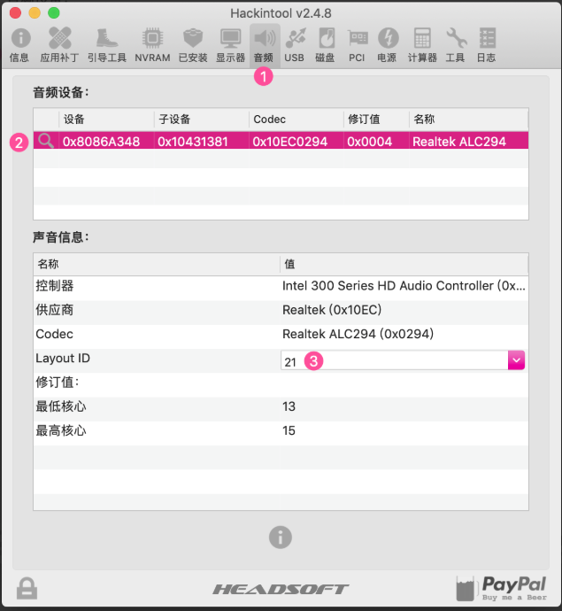
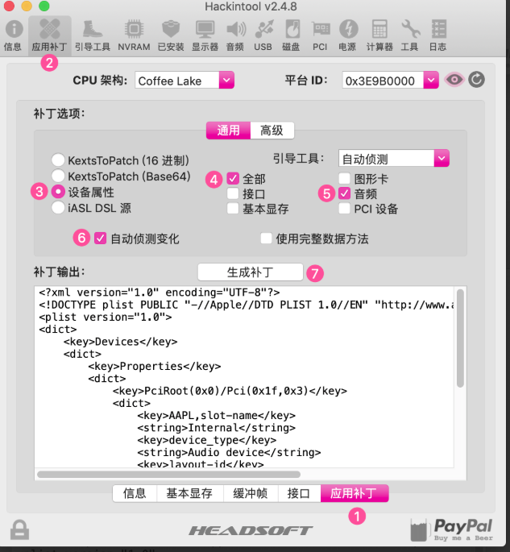

# X79主板安装macOS 11.12.6 安装说明


> 安装目标：macOS 11.12.6
>
> 主板型号：X79
>
> cpu: E5 2680 v1
>
> 网卡：RTL8168
>
> 声卡：Realtek ALC662
>
> 显卡：GTX650 1024M

## 0. bios 设置


* 关闭VT-d
* 开启 USB XHCI
* 关闭 USB EHCI
* 禁用 Serial Port
## 1. DSDT 提取和修复
- clover界面F4提取
- 编译成.aml
- 存放到EFI路径： OEM/X79/ACPI/patched
## 2. clover EFI目录驱动
>目录结构
>EFI/Clover/OEM/X79/kexts
>├── 10.11
>├── 10.12
│   ├── AppleALC.kext
│   ├── CPUFriend.kext
│   ├── FakeSMC.kext
│   ├── Lilu.kext
│   ├── LiluFriend.kext
│   ├── RealtekRTL8111.kext
│   ├── USBInjectAll.kext
│   ├── VoodooPS2Controller.kext
│   ├── VoodooTSCSync.kext
│   └── WhateverGreen.kext
├── 10.13
├── 10.14
├── 10.15
## 3. config.plist文件

[config.plist](./config.plist)

## 4. 网卡 RealtekRTL8111.kext 免驱
## 5. 显卡 GTX650 免驱
## 6. 声卡驱动 （我的x79注入id为5）
### 6.1 声卡修补
- 安装最新的 Lilu + AppleALC
- Clover Configurator 设置 config.plist ▸ Devices ▸ Audio ▸ Inject ▸ No
- 四叶草 (Clover) ▸ DSDT 重命名以下设备（如果需要）
  ☑️ AZAL ▸ HDEF
  ☑️ HDAS ▸ HDEF
- Hackintool 中 选中 补丁 ▸ 通用 ▸ 声音
- 设置 音频中 Layout ID下拉列表，选择或输入合适你的 Layout ID（X79以确定为5）
- 文件 ▸ 导出 ▸ Clover Config.plist（覆盖现有的config.plist文件）
- 重新启动
>如果没有音频依然存在问题，请返回步骤4并尝试不同的 Layout ID 注意：如果您尝试所有 Layout ID 但仍有问题，请尝试设置 补丁 ▸ 高级 ▸ 仿冒声卡 ID 选项。 如果这依然不起作用，那么尝试安装FakePCIID.kext + FakePCIID_Intel_HDMI_Audio.kext




## 7. 电源管理 CPUFriend.kext 

> 生成CPUFriendDataProvider.kext [ResourceConverter.sh](https://github.com/acidanthera/CPUFriend/blob/master/Tools/ResourceConverter.sh)

### 7.1 经过不断地测试，初步可以总结出以下几点经验
>要想对变频效果进行调整及优化，
首先确保要加载了原生电源管理（从第四代CPU开始，都不加载CPU管理驱动了），体现在两个X86加载都是是(X86PlatformPlugin.kext, X86PlatformShim.kext)，有完整的电源管理面板。
* 加载X86有两种方法：
    * 采用ssdtPRGen.sh生成的ssdt。
    * 采用SSDT-XCPM.ssdt，clover设置plugin-Type=1（适用于Haswell后的CPU）
      >理论上应该如此，但在实际测试中需配合CPUFriend和CPUDateProvider才可以实现加载x86 以及完整的电源管理面板。

* 当以上情况满足后，就可以通过CPUDateProvider来提供变频所需要的数据，可以尝试不同机型的plist生成的CPUDateProvider，以达到最佳变频效果。

### 7.2 具体操作步骤：
- 1. 下载CPUFriernd.kext
- 2. 下载ResourceConverter.sh
- 3. 在ResourceConverter.sh所在目录运行以下命令

  ```java
  ./ResourceConverter.sh --kext /System/Library/Extensions/IOPlatformPluginFamily.kext/Contents/PlugIns/X86PlatformPlugin.kext/Contents/Resources/Mac-F60DEB81FF30ACF6.plist
  ```
  其中后边的文件按目录找到对应SMBIOS机型board-ID对应的plist拖入终端即可，其中board-ID可以用clover查看

- 4. 完成后在ResourceConverter.sh同级目录下会生成一个CPUFriendDataProvider.kext文件，将其连同CPUFriend.kext放入clover的kext下即可
- 5. 重启查看变频效果

**参考：**

  - CPUFriend使用说明（https://blog.daliansky.net/CPUFriend-Installation-and-Usage.html ）

  - 变频教程-电源管理（https://change-y.github.io/2018/04/30/%E5%88%A9%E7%94%A8CPUFriend-kext%E5%AE%9E%E7%8E%B0%E5%8F%98%E9%A2%91/ ）

## 8. 变频

- ssdt生成 https://github.com/Piker-Alpha/ssdtPRGen.sh

## 9. usb定制
