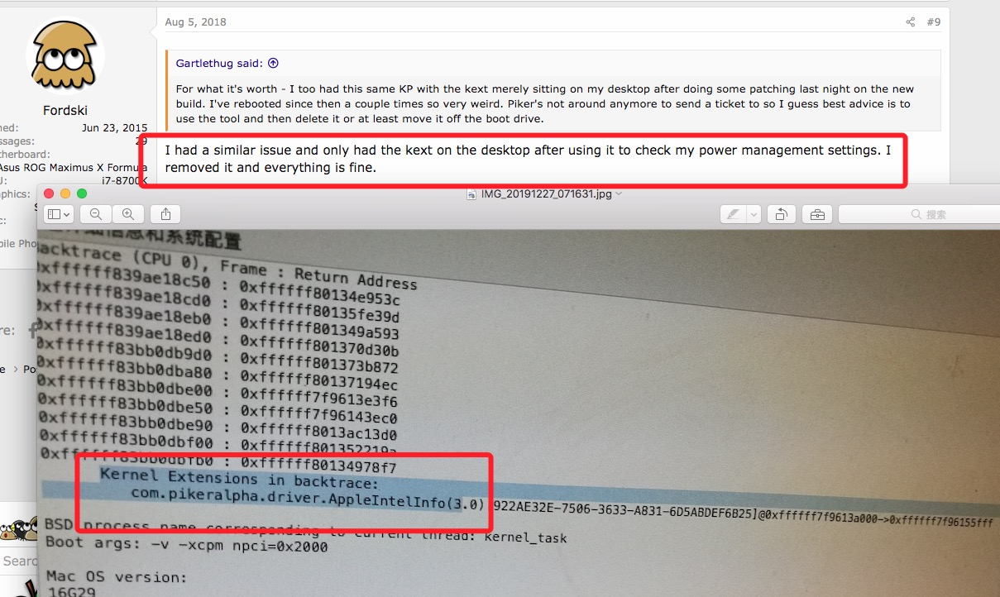

# huanan x79 烈焰战神 双网口 alc887（id=11) 问题收集
## 关于“您的电脑因为出现问题而重新启动“还有关机不断电的问题解决

```javascript
Backtrace continues...
Kernel Extensions in backtrace:
com.pikeralpha.driver.AppleIntelInfo(3.0)[0E1E3F2C-E41C-33A7-9DA0-7A5E868B3B80]@0xffffff7f863ba000->0xffffff7f863d5fff
```
- [链接地址](https://www.tonymacx86.com/threads/solved-crash-report-how-to-fix-this.243207/)
 - 解决方案


删除AppleIntelInfo 无论他在任何位置

## 10.13 问题  AppleACPIPlatform(MACH Reboot)


```
dsdt 删除
Store ("CPUSCK0", CUU0)
Store ("CPUSCK1", CUU1)
Store ("CPUSCK2", CUU2)
Store ("CPUSCK3", CUU3)
```
解决链接：https://www.itmanbu.com/appleacpiplatform.html
https://github.com/cheneyveron/clover-x79-e5-2670-gtx650
搜索：AppleACPIPlatform(MACH Reboot）
